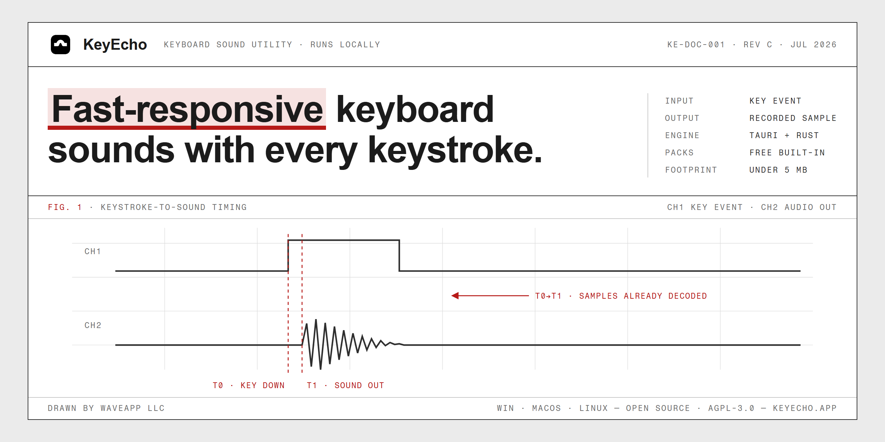

<p align="center">
  
</p>

<p align="center">
  <a href="https://trendshift.io/repositories/14140" target="_blank"></a>
</p>

# KeyEcho

KeyEcho is a tiny open-source desktop app that plays pleasant keyboard sounds
while you type. It is built with Tauri, Rust, and Solid, and is designed to stay
local, fast, and easy to audit.

[Website](https://keyecho.app) · [Download](https://github.com/ZacharyL2/KeyEcho/releases/latest) · [Technical write-up](https://upweb.dev/posts/open-sourced-keyecho) · [Custom sounds](docs/custom-sounds.md)

## Why

- Local keyboard event handling for low-latency sound playback.
- Cross-platform builds for Windows, macOS, and Linux.
- Small native desktop footprint instead of a bundled browser runtime.
- No account, cloud sync, or typing-content analytics.
- Custom sound packs for people who want to tune the typing feel.

## Sound Packs

KeyEcho itself stays free and open source. Paid premium sound packs are planned
as optional content that funds recording, tuning, and maintenance.

The current founding bundle is a one-time $9.99 early-supporter offer:

- Includes the first batch of studio-recorded premium packs.
- Includes any extra premium packs released during the founding period.
- Gives founder vote priority for the next pack queue.
- Is not a subscription.
- Is not required to keep using KeyEcho.
- Is not a lifetime pass for every future sound pack.

You can vote for the next packs or back the founding bundle on
[keyecho.app](https://keyecho.app).

Want to create your own? See the [custom sounds guide](docs/custom-sounds.md)
for recording, processing, and adding your own sound packs to KeyEcho.

## Documentation

- [Custom sounds guide](docs/custom-sounds.md)
- [Performance notes](docs/performance.md)
- [Changelog](CHANGELOG.md)

## Install

Download the latest build from the
[GitHub Releases page](https://github.com/ZacharyL2/KeyEcho/releases/latest).

Supported targets:

- Windows x64 / ARM64
- macOS Intel / Apple Silicon
- Linux x64 / ARM64

KeyEcho needs the operating system permissions required for global keyboard
event listening. It maps key events to local sound playback; it does not upload
typed content.

## Development

### Prerequisites

- [Rust and Cargo](https://www.rust-lang.org/tools/install)
- [pnpm](https://pnpm.io/installation)

### Run Locally

```bash
git clone git@github.com:ZacharyL2/KeyEcho.git
cd KeyEcho
pnpm install
pnpm dev
```

### Useful Commands

```bash
pnpm web:dev       # Vite frontend only
pnpm web:build     # Type-check and build the frontend
pnpm test:rust     # Rust tests
pnpm test          # Rust tests, web tests, and frontend build
pnpm build         # Tauri production build
```

## License

KeyEcho is released under the [AGPL-3.0 license](./LICENSE).
